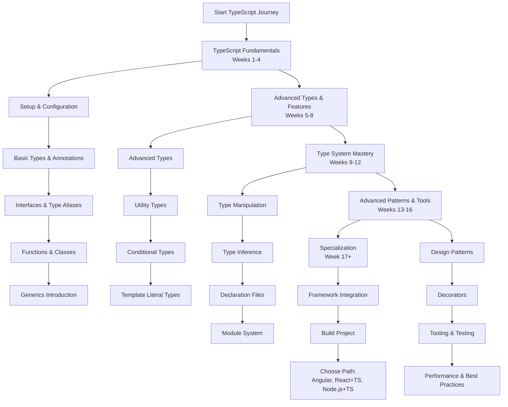

# TypeScript Developer Learning Path: A Structured Curriculum

This comprehensive roadmap provides a structured approach to mastering TypeScript development. The curriculum is designed sequentially, with each module building upon previous knowledge to ensure a solid foundation and progressive skill development.

---

## Phase 1: TypeScript Fundamentals (Weeks 1-4)

*   [**Module 1: Introduction & Development Environment**](https://github.com/example/ts-intro/#readme)
    *   TypeScript Overview: Benefits, Compilation Process, and Relationship with JavaScript
    *   TypeScript Ecosystem: tsc compiler, tsconfig.json, and TypeScript Playground
    *   Setting Up Development Environment: Node.js, TypeScript Compiler, VS Code with TypeScript extensions
    *   Configuring tsconfig.json: Compiler Options, Target Environments, Module Systems
    *   "Hello World" in TypeScript: Writing, Compiling, and Running TypeScript Code

*   [**Module 2: Basic Types & Type Annotations**](https://github.com/example/ts-basic-types/#readme)
    *   Primitive Types: `string`, `number`, `boolean`, `null`, `undefined`, `symbol`, `bigint`
    *   Type Annotations: Explicit vs Implicit Typing, Type Inference
    *   Special Types: `any`, `unknown`, `never`, `void`
    *   Array Types: `type[]` and `Array<type>` syntax
    *   Tuple Types: Fixed-length Arrays with Specific Types
    *   Enum Types: Numeric and String Enums, Const Enums

*   [**Module 3: Interfaces & Type Aliases**](https://github.com/example/ts-interfaces/#readme)
    *   Interface Declaration: Optional Properties, Readonly Properties, Index Signatures
    *   Type Aliases vs Interfaces: Differences and Use Cases
    *   Function Types in Interfaces and Type Aliases
    *   Extending Interfaces and Intersection Types
    *   Declaration Merging with Interfaces

*   [**Module 4: Functions & Classes**](https://github.com/example/ts-functions-classes/#readme)
    *   Function Type Annotations: Parameters, Return Types, Optional Parameters
    *   Function Overloads: Multiple Function Signatures
    *   Class Members: Properties, Methods, Constructors with Access Modifiers (`public`, `private`, `protected`)
    *   Readonly Modifier and Parameter Properties
    *   Getters and Setters with Access Control

*   [**Module 5: Introduction to Generics**](https://github.com/example/ts-generics-intro/#readme)
    *   Generic Functions: Creating Reusable Type-Safe Functions
    *   Generic Interfaces and Classes
    *   Working with Constraints using `extends` keyword
    *   Generic Utility Functions and Common Patterns

---

## Phase 2: Advanced Types & Features (Weeks 5-8)

*   [**Module 6: Advanced Type Concepts**](https://github.com/example/ts-advanced-types/#readme)
    *   Union Types and Type Narrowing with Type Guards
    *   Intersection Types and Type Combination
    *   Literal Types: String, Numeric, and Boolean Literals
    *   Type Predicates and User-Defined Type Guards
    *   Discriminated Unions and Exhaustiveness Checking

*   [**Module 7: Utility Types**](https://github.com/example/ts-utility-types/#readme)
    *   Transformation Types: `Partial`, `Required`, `Readonly`, `Record`
    *   Key Manipulation: `Pick`, `Omit`, `Extract`, `Exclude`
    *   Function Types: `Parameters`, `ReturnType`, `ConstructorParameters`
    *   String Manipulation Types: `Uppercase`, `Lowercase`, `Capitalize`
    *   Creating Custom Utility Types

*   [**Module 8: Conditional Types**](https://github.com/example/ts-conditional-types/#readme)
    *   Conditional Type Syntax: `T extends U ? X : Y`
    *   Type Inference in Conditional Types with `infer` keyword
    *   Distributed Conditional Types
    *   Recursive Conditional Types and Type-Level Programming
    *   Built-in Conditional Types: `NonNullable`, `Awaited`

*   [**Module 9: Template Literal Types**](https://github.com/example/ts-template-literals/#readme)
    *   String Template Types and Pattern Matching
    *   String Manipulation at Type Level
    *   Union Types in Template Literals
    *   Advanced Pattern: API Route Validation, CSS-in-TS

---

## Phase 3: Type System Mastery (Weeks 9-12)

*   [**Module 10: Type Manipulation & Mapped Types**](https://github.com/example/ts-type-manipulation/#readme)
    *   Mapped Types: `keyof` operator and Index Types
    *   Mapping Modifiers: `+` and `-` modifiers for `readonly` and `?`
    *   Key Remapping with `as` clause
    *   Homomorphic Mapped Types and their behavior
    *   Advanced Patterns: Deep Partial, Deep Readonly, etc.

*   [**Module 11: Type Inference & Compatibility**](https://github.com/example/ts-type-inference/#readme)
    *   Type Inference Mechanisms: Best Common Type, Contextual Typing
    *   Type Compatibility: Structural vs Nominal Typing
    *   Function Parameter Bivariance and Strict Mode
    *   Freshness and Excess Property Checks
    *   Covariance, Contravariance, and Invariance

*   [**Module 12: Declaration Files & Module System**](https://github.com/example/ts-declarations/#readme)
    *   Writing Declaration Files (.d.ts) for JavaScript Libraries
    *   Module Declaration and Ambient Modules
    *   Namespaces vs Modules in TypeScript
    *   Triple-Slash Directives and Reference Comments
    *   Using DefinitelyTyped (@types) packages

*   [**Module 13: Advanced Generics**](https://github.com/example/ts-advanced-generics/#readme)
    *   Generic Constraints with Multiple Types
    *   Using Type Parameters in Generic Constraints
    *   Generic Conditional Types
    *   Mapped Types with Generics
    *   Recursive Generic Types

---

## Phase 4: Advanced Patterns & Tooling (Weeks 13-16)

*   [**Module 14: TypeScript Design Patterns**](https://github.com/example/ts-design-patterns/#readme)
    *   Factory Pattern with Generic Return Types
    *   Builder Pattern with Method Chaining and Type Safety
    *   Adapter Pattern with Interface Segregation
    *   Strategy Pattern with Function Types
    *   Dependency Injection with Interfaces

*   [**Module 15: Decorators & Metadata**](https://github.com/example/ts-decorators/#readme)
    *   Decorator Factories and Composition
    *   Class Decorators, Method Decorators, Property Decorators
    *   Parameter Decorators and Accessor Decorators
    *   Metadata Reflection API
    *   Experimental Decorators and ECMAScript Proposal

*   [**Module 16: Tooling & Testing**](https://github.com/example/ts-tooling/#readme)
    *   Advanced tsconfig.json Configuration
    *   TypeScript Compiler API for Custom Tooling
    *   Testing TypeScript: Jest, Mocha with TypeScript
    *   Debugging TypeScript Applications
    *   Bundle Analysis and Performance Optimization

*   [**Module 17: Performance & Best Practices**](https://github.com/example/ts-best-practices/#readme)
    *   Type-Only Imports and Exports
    *   Avoiding Any and Using Unknown Properly
    *   Performance Considerations: Type Instantiation Depth
    *   Code Organization: Barrel Files, Path Mapping
    *   Strict Mode and Linting Configuration

---

## Phase 5: Framework Integration & Specialization

*   [**Module 18: Framework-Specific TypeScript**](https://github.com/example/ts-frameworks/#readme)
    *   **React with TypeScript:** Component Typing, Hooks, Higher-Order Components
    *   **Angular with TypeScript:** Dependency Injection, Decorators, RxJS Types
    *   **Vue with TypeScript:** Composition API, Component Props, Vuex Typing
    *   **Node.js with TypeScript:** Express Typing, Database Integration, API Development

*   [**Module 19: Build Tools & CI/CD**](https://github.com/example/ts-build-tools/#readme)
    *   Webpack Configuration for TypeScript
    *   Babel with TypeScript Preset
    *   ESLint and Prettier for TypeScript
    *   Continuous Integration with TypeScript Projects
    *   Monorepo Management with TypeScript

*   [**Module 20: Capstone Project & Specialization**](https://github.com/example/ts-capstone/#readme)
    *   **Build a Full-Stack TypeScript Application**
    *   **Choose a Specialization Path:**
        *   **Enterprise Backend:** Node.js, TypeORM, GraphQL with TypeScript
        *   **Frontend Framework Specialist:** React/Angular/Vue with Advanced Type Patterns
        *   **Full-Stack TypeScript:** Next.js, NestJS, Prisma with End-to-End Typing
        *   **Tooling & Library Development:** Creating Type-Safe Libraries and Developer Tools

---

## Additional Resources

*   [**TypeScript Coding Guidelines**](https://github.com/example/ts-style-guides/#readme) - TypeScript Official Style Guide and Best Practices
*   [**TypeScript Challenges**](https://github.com/example/ts-challenges/#readme) - Type Puzzles and Advanced Type Challenges
*   [**TypeScript Ecosystem**](https://github.com/example/ts-ecosystem/#readme) - Popular TypeScript Libraries and Tools
*   [**Migration Strategies**](https://github.com/example/ts-migration/#readme) - Migrating JavaScript Projects to TypeScript
*   [**TypeScript Community**](https://github.com/example/ts-community/#readme) - Blogs, Conferences, and Learning Resources

**Note:** Each module includes hands-on exercises, real-world projects, and type challenges to reinforce learning. The timeline is flexible and can be adjusted based on individual pace and prior JavaScript/TypeScript experience.
